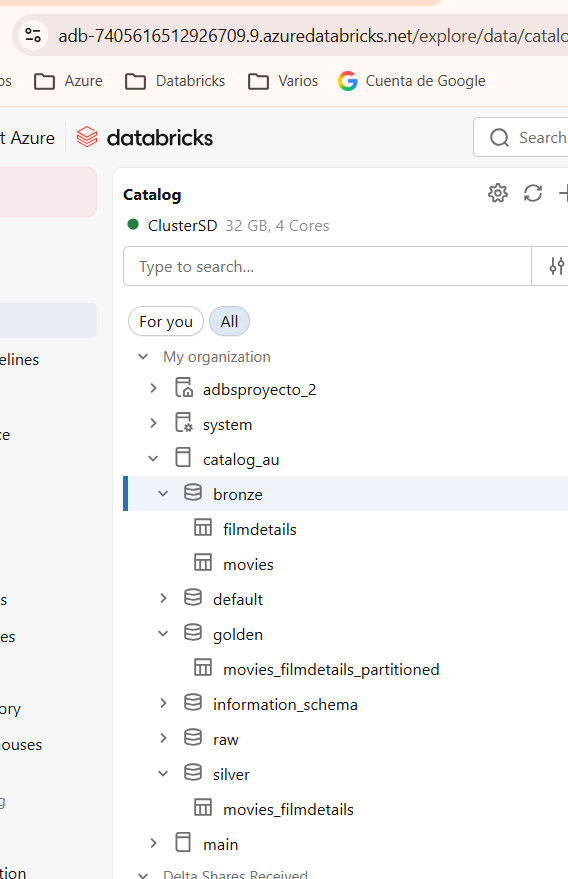
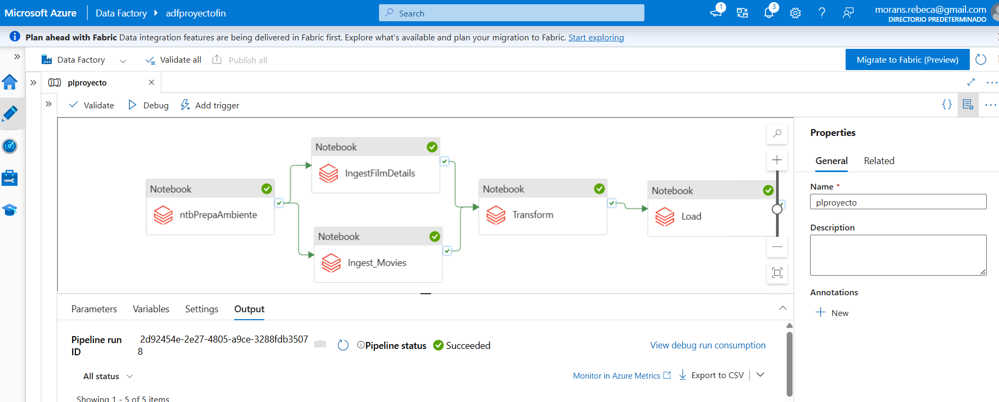
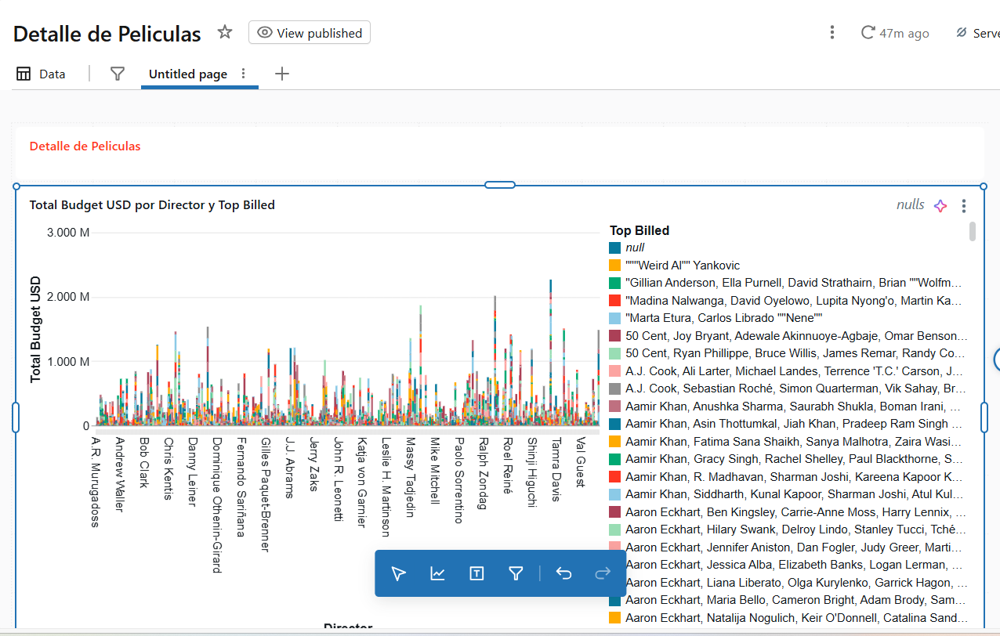
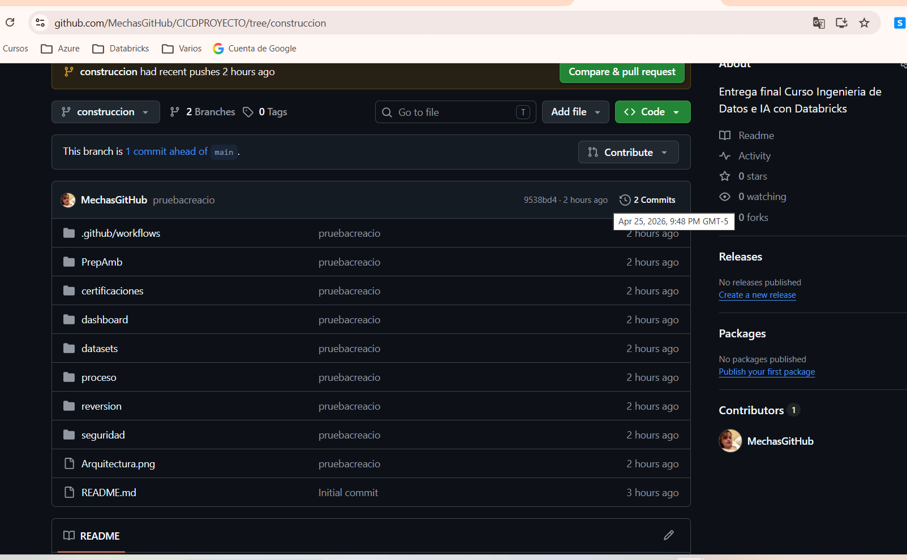

# CICDPROYECTO
Entrega final Curso Ingenieria de Datos e IA con Databricks

## Detalle de las actividades realizadas

1. **Aprovisionamiento del entorno**
   - Se configuró el workspace de Databricks y se realizó el aprovisionamiento de recursos necesarios, incluyendo clústeres y almacenamiento para el proyecto.

2. **Carga de esquemas y tablas**
   - Se diseñaron y cargaron los esquemas de datos, creando las tablas necesarias para almacenar la información relevante del proyecto.

3. **Creación del dashboard**
   - Se desarrolló un dashboard interactivo en Databricks para visualizar y analizar los datos procesados, facilitando la toma de decisiones.

4. **Versionamiento y despliegue en GitHub**
   - Finalmente, se versionó el proyecto utilizando Git y se subió el código, notebooks y artefactos al repositorio de GitHub para asegurar la trazabilidad y colaboración.

